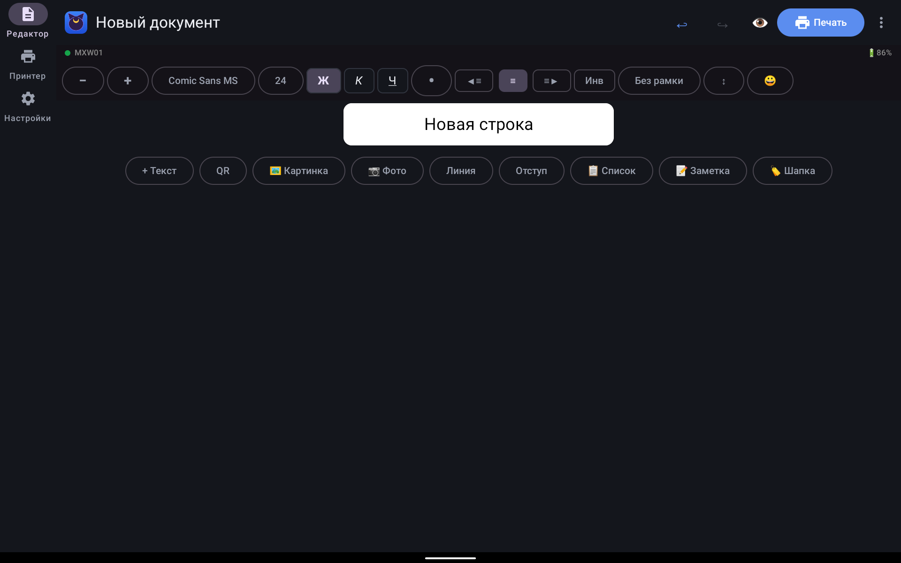
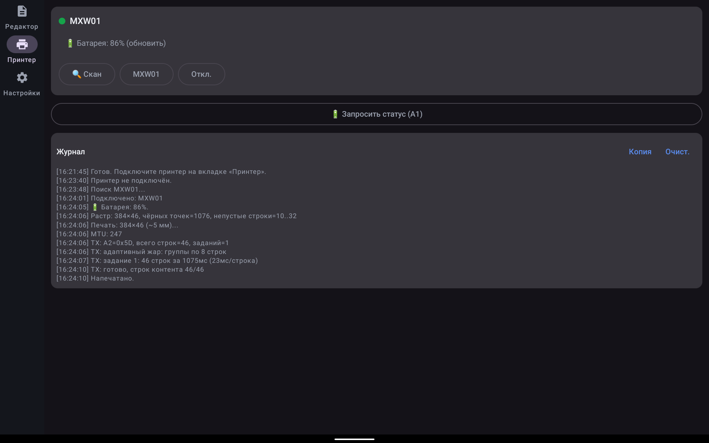

# CatPrint Android

Мобильная печать на карманном термопринтере MXW01 — для тех, у кого принтер
живёт в сумке, а не у компьютера: ценники, записки, QR-коды, фото-стикеры
прямо с телефона или планшета. Подключение по BLE, бумага 57 мм (384 точки).

Старший брат — [CatPrint для ПК (WPF)](https://github.com/SaymonRen-ui/catprint):
протокол печати перенесён оттуда побайтово (A2/A9/AD, CRC8, LSB), а формат
документов `.catdoc` v2 общий — файлы открываются и там, и там.

## Скриншоты (планшет)

## Адаптив
- Узкий экран (телефон-портрет): нижняя навигация.
- Широкий (альбом/планшет): боковая рейка.
- Ширина бумаги всегда 384 точки, меняется только масштаб и панели.
- Поворот не теряет документ и не рвёт печать (состояние во ViewModel).

## Сборка
1. Открыть папку в Android Studio (или `gradlew`).
2. `gradlew assembleDebug` → `app/build/outputs/apk/debug/CatPrint.apk`.
3. Юнит-тесты ядра (без устройства): `gradlew :app:testDebugUnitTest`.
   Проверяют CRC/команды/упаковку бит/дизеринги теми же векторами, что и ПК.

Требования: JDK 17, Android SDK (compileSdk 36, minSdk 26).

## Разрешения
- Android 12+: BLUETOOTH_SCAN, BLUETOOTH_CONNECT.
- Android ≤11: местоположение (требование ОС для BLE-скана).
- Чтение картинок из галереи.

## Структура
- `core/printer` — протокол, CRC, 10 дизерингов, упаковка растра, пайплайн фото
  (чистый Kotlin, без Android — покрыт тестами).
- `core/doc` — блоки, `.catdoc` v2, рендер в Bitmap 384.
- `ble` — скан, GATT-клиент AE30/AE01/AE02/AE03, notify, батарея BAS/A1.
- `print` — поток печати A2→A9→строки→AD.
- `ui` — Compose: редактор, принтер, настройки; Material3, тёмная тема.
- `data` — настройки (SharedPreferences), пресеты как на ПК.
